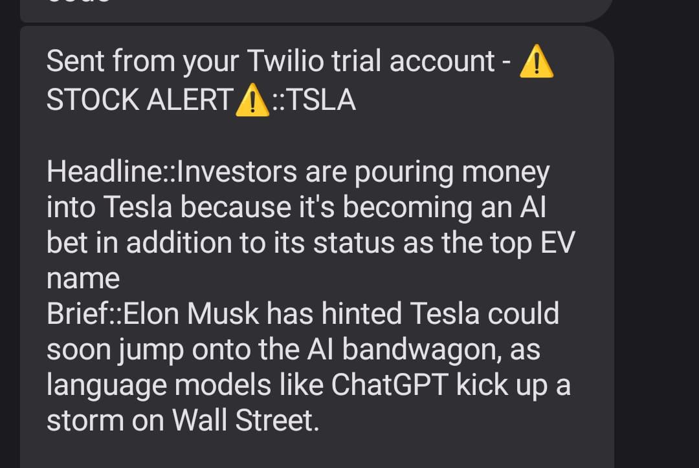

# Stock-Trend-Monitor

A Python-based Stock Market Prediction app, monitoring user-specified stock and sending timely text messages upon specific price fluctuations using AlphaVantage, NewsORG, and Twilio APIs.

